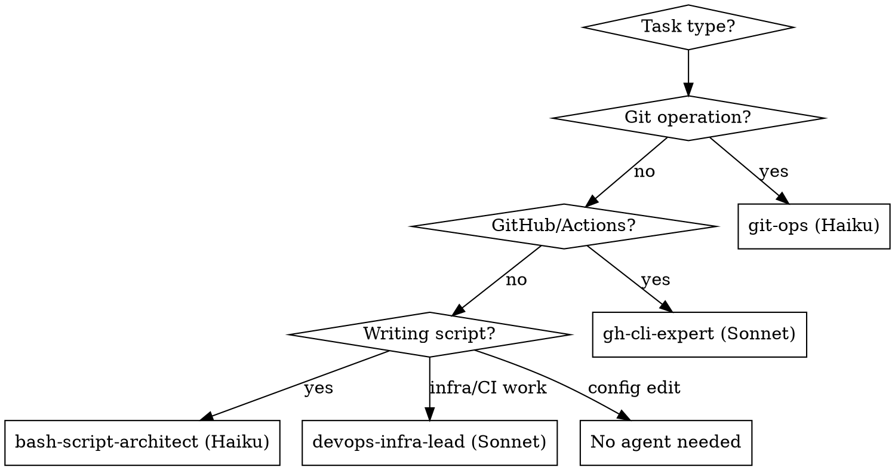

# Dotfiles Development

## Symlink Architecture

```
~/.dotfiles -> <repo>/.dotfiles     # Primary anchor
~/.zshrc                            # Bootstrap file (sources ~/.dotfiles/zshrc)
~/.ssh/config -> ~/.dotfiles/ssh/config
~/.config/nvim -> ~/.dotfiles/nvim
```

All paths resolve through `~/.dotfiles`. Scripts find the repo via:
```bash
DOTFILES_DIR="$(dirname "$(readlink -f "$HOME/.dotfiles")")"
```

## Agent Selection



| Agent | Model | Use For |
|-------|-------|---------|
| `git-ops` | Haiku | **All git operations** - commits, branches, status. Isolates git context from main conversation. |
| `bash-script-architect` | Haiku | Writing/debugging bash scripts |
| `gh-cli-expert` | Sonnet | GitHub Actions failures, PR management, gh CLI |
| `devops-infra-lead` | Sonnet | Infrastructure, CI/CD, system admin |

**Important:** For committing changes, use the `git-ops` agent (not generic skills). It keeps git output isolated from the main context window.

## Wrapper Scripts (bin/claude/)

| Script | Model | Purpose |
|--------|-------|---------|
| `push` | Haiku | Quick commit/push with conventional commits |
| `ghcli` | Sonnet | GitHub CLI operations |
| `support` | Opus | Bash debugging with web search |

## Adding New Configurations

1. **Add file** to `.dotfiles/` (no dot prefix in name)
2. **Add chmod** line to `fix-perms.sh`:
   - Scripts/dirs: `chmod 700`
   - Config files: `chmod 600`
3. **Add symlink** (if needed) to `setup_symlinks()` in `install.sh`

## Permission Model

| Type | Permission | Example |
|------|------------|---------|
| Directories | 700 | `.dotfiles/nvim/` |
| Scripts | 700 | `install.sh`, `sync.sh` |
| Config files | 600 | `zshrc`, `ssh/config` |

Git hooks auto-fix permissions on pulls via `fix-perms.sh`.

## Testing Changes

```bash
source ~/.zshrc          # Reload shell config
./install.sh             # Safe to re-run (idempotent)
ls -la                   # Verify permissions
```

## Common Mistakes

| Mistake | Fix |
|---------|-----|
| Adding dot prefix to files | Use `zshrc` not `.zshrc` - symlinks add the dot |
| Forgetting fix-perms.sh | Every new file needs a chmod line |
| Wrong permission value | Scripts=700, configs=600 |
| Editing ~/.zshrc directly | Edit `.dotfiles/zshrc` - bootstrap file just sources it |
| Hardcoding paths | Use `$HOME/.dotfiles` or resolve via symlink |

## Key Files

- `.dotfiles/install.sh` - Bootstrap, symlinks, dependencies
- `.dotfiles/fix-perms.sh` - Permission management
- `.dotfiles/sync.sh` - Pull and fix permissions
- `.dotfiles/CLAUDE.md` - Additional dev guidance
